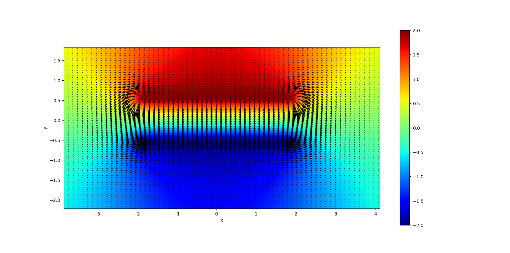
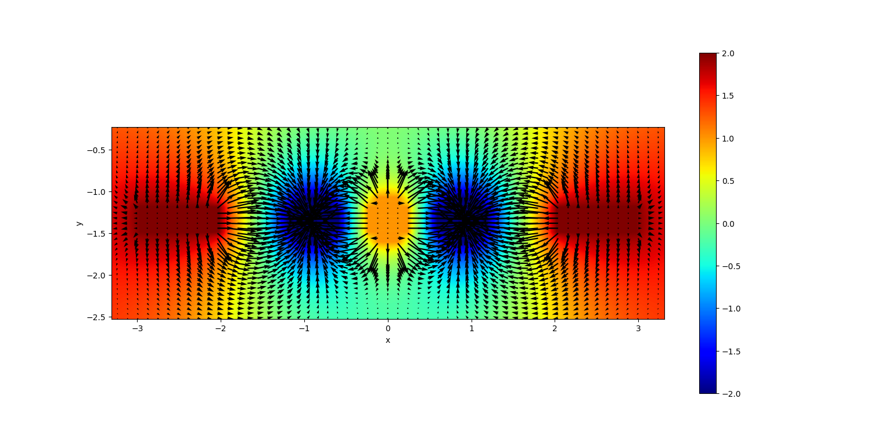
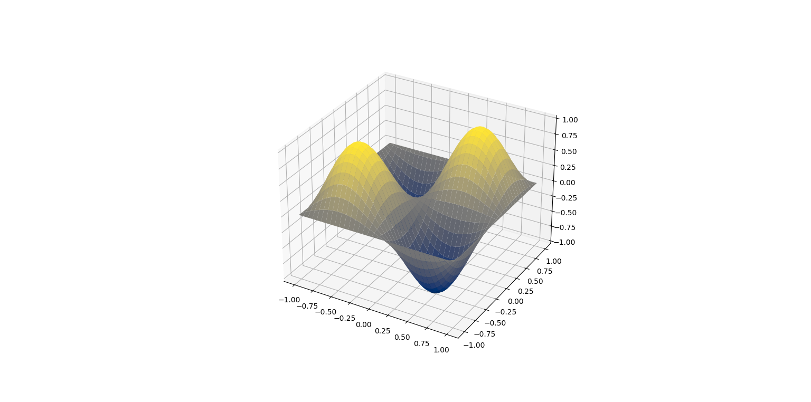

# Methods for solving Poisson's equation &Delta;u(x,y) = g(x,y)

## Build

```
mkdir build
cd build
cmake ..
cmake --build . --config Release
```

## Results

g(x,y) = 0; 
boundary condition: 
    &part;u/&part;x = 0 &part;u/&part;y = 0
additional conditions 
    u = 2 if x &isin; [-2; 2], y &isin;[0.5, 0.6];
    u = - 2 if x &isin; [-2; 2], y &isin;[-0.6, -0.5];



g(x,y) = 0
boundary condition:
    &part;u/&part;x = 0 &part;u/&part;y = 0
additional conditions 
    u = 2 if x &isin; [-3; -2], y &isin;[-1.5, -1.2];
    u = 2 if x &isin; [2; 3], y &isin;[-1.5, -1.2];
    u = -2 if (x + 0.9)^2 + (y + 1.3)^2 < 0.1;
    u = -2 if (x - 0.9)^2 + (y + 1.3)^2 < 0.1;
    u = 1 if x^2 + (y + 1.3)^2 < 0.1;



g(x,y) = - 2 * &pi;^2 * sin(&pi; * x) * sin(&pi; * y)
boundary condition:
    &part;u = 0 


